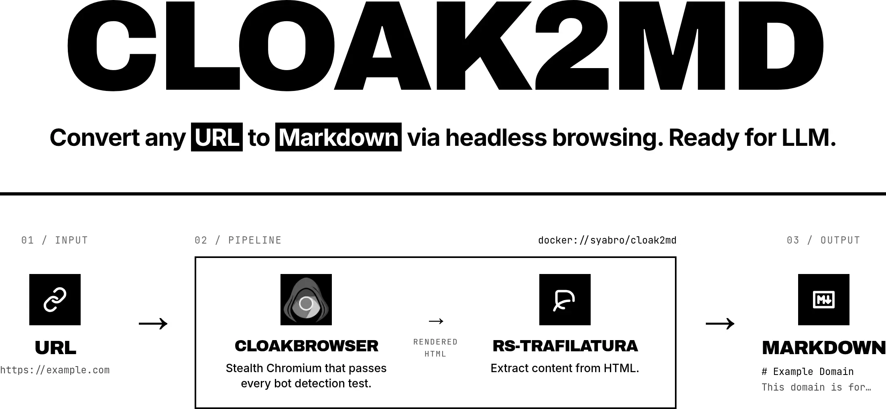

# cloak2md

**One command turns a web page into clean Markdown — even when `curl` fails.**

Use `cloak2md` when:

- you need to feed a page to an LLM and raw HTML is too noisy for the context window;
- a plain `curl` or `fetch` returns an empty shell because the page is rendered by JavaScript;
- the site is gated by Cloudflare, hCaptcha, or similar anti-bot checks;
- you want one tool that handles all three without picking a scraping engine.

```bash
cloak2md https://example.com
```

That's the whole job. Markdown to stdout, ready to paste into a prompt, a note, or a RAG pipeline.

## How it works

Under the hood, `cloak2md` chains two existing projects so you don't have to: [CloakBrowser](https://github.com/CloakHQ/CloakBrowser) renders the page past anti-bot checks, and [rs-trafilatura](https://github.com/Murrough-Foley/rs-trafilatura) strips it down to readable Markdown. It's a small Docker wrapper — no new scraper, no new engine.

## Install

Add this alias to your shell config, then reload your shell:

```bash
alias cloak2md='docker run --rm -i syabro/cloak2md'
```

## Run

```bash
cloak2md https://example.com
```

Save the Markdown:

```bash
cloak2md https://example.com > page.md
```

## Content troubleshooting

Pick the fix by symptom. Try one change at a time.

**Output is empty or stub-like.** The page is still loading. Wait a few seconds:

```bash
cloak2md https://example.com --wait 5
```

**You need a specific section that loads later.** Wait for the element:

```bash
cloak2md https://example.com --wait-for-selector ".pricing-card"
```

**Output is full of nav, footer, cookie banners, or related links.** Use precision mode:

```bash
cloak2md https://example.com --favor-precision
```

Precision mode trims more non-content text. On complex pages it can also remove useful content.

**Output is missing tables, pricing cards, or docs sections.** Use recall mode:

```bash
cloak2md https://example.com --favor-recall
```

Recall mode keeps more text. It helps on pricing cards, docs pages, and tables where the extractor cuts too much. It can also include more noise.

## JSON output

Use `--json` when you need metadata such as the final URL, page title, extraction quality, and Markdown length:

```bash
cloak2md https://example.com --json
```

## All options

```bash
cloak2md --help
```

## Development

```bash
docker build -t cloak2md:local .
docker run --rm cloak2md:local https://example.com
```
