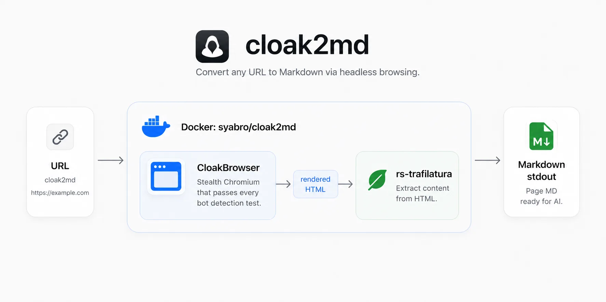

# cloak2md

`cloak2md` opens a page in [CloakBrowser](https://github.com/CloakHQ/CloakBrowser), extracts the rendered HTML with [rs-trafilatura](https://github.com/Murrough-Foley/rs-trafilatura), and prints clean Markdown.

Use it for pages where bot and automation detectors get in the way of scraping.

It's a small Docker wrapper that makes those two tools easy to run together, without adding a new scraping engine.

## Install

Add this alias to your shell config, then reload your shell:

```bash
alias cloak2md='docker run --rm -i syabro/cloak2md'
```

## Run

```bash
cloak2md https://example.com
```

Save the Markdown:

```bash
cloak2md https://example.com > page.md
```

If the output is empty or missing content, wait a few seconds:

```bash
cloak2md https://example.com --wait 5
```

If you need content from a specific part of the page, wait for that element:

```bash
cloak2md https://example.com --wait-for-selector ".pricing-card"
```

## Extraction modes

Use the default mode first. If the output is noisy, try precision mode:

```bash
cloak2md https://example.com --favor-precision
```

Precision mode removes more non-content text: navigation, footers, cookie banners, and related links. It can also remove useful content on complex pages.

If the output is missing important content, try recall mode:

```bash
cloak2md https://example.com --favor-recall
```

Recall mode keeps more text from the page. It is useful for pricing cards, docs pages, tables, and pages where the extractor cuts too much. It can include more noise.

## JSON output

Use `--json` when you need metadata such as the final URL, page title, extraction quality, and Markdown length:

```bash
cloak2md https://example.com --json
```

## All options

```bash
cloak2md --help
```

## Development

```bash
docker build -t cloak2md:local .
docker run --rm cloak2md:local https://example.com
```
