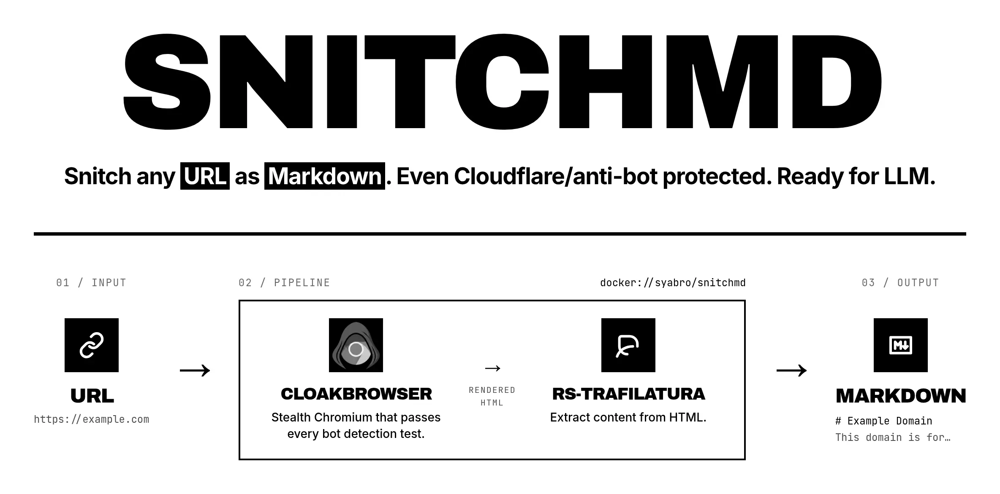

# snitchmd

**Snitch any URL as Markdown. Even Cloudflare/anti-bot protected. Ready for LLM.**

Use `snitchmd` when:

- you need to feed a page to an LLM and raw HTML is too noisy for the context window;
- a plain `curl` or `fetch` returns an empty shell because the page is rendered by JavaScript;
- the site is gated by Cloudflare, reCAPTCHA, or similar anti-bot checks;
- you want one tool that handles all three without picking a scraping engine.

```bash
snitchmd https://example.com
```

That's the whole job. Markdown to stdout, ready to paste into a prompt, a note, or a RAG pipeline.

## How it works

Under the hood, `snitchmd` chains two existing projects so you don't have to: [CloakBrowser](https://github.com/CloakHQ/CloakBrowser) renders the page past anti-bot checks, and [rs-trafilatura](https://github.com/Murrough-Foley/rs-trafilatura) strips it down to readable Markdown. It's a small Docker wrapper — no new scraper, no new engine.

## Install

Add this alias to your shell config, then reload your shell:

```bash
alias snitchmd='docker run --rm -i -v "${XDG_CACHE_HOME:-$HOME/.cache}/snitchmd:/cache" syabro/snitchmd'
```

## Run

```bash
snitchmd https://example.com
```

Save the Markdown:

```bash
snitchmd https://example.com > page.md
```

## Cache

Each successful fetch is cached on disk by URL + relevant flags. Re-running the same command reads from cache (no browser launch, no extraction).

- Location: `${XDG_CACHE_HOME:-$HOME/.cache}/snitchmd/` on the host (mounted into the container as `/cache`).
- Bypass and refresh a single URL: `snitchmd --no-cache https://example.com`.
- Wipe everything: `rm -rf ~/.cache/snitchmd`.
- Output-only flags (`--json`, `--html-output`) don't affect the cache key, so the same URL is cached once across them.

## Update

```bash
docker pull syabro/snitchmd
```

## Content troubleshooting

Pick the fix by symptom. Try one change at a time.

**Output is empty or stub-like.** The page is still loading. Wait a few seconds:

```bash
snitchmd https://example.com --wait 5
```

**You need a specific section that loads later.** Wait for the element:

```bash
snitchmd https://example.com --wait-for-selector ".pricing-card"
```

**Output is full of nav, footer, cookie banners, or related links.** Use precision mode:

```bash
snitchmd https://example.com --favor-precision
```

Precision mode trims more non-content text. On complex pages it can also remove useful content.

**Output is missing tables, pricing cards, or docs sections.** Use recall mode:

```bash
snitchmd https://example.com --favor-recall
```

Recall mode keeps more text. It helps on pricing cards, docs pages, and tables where the extractor cuts too much. It can also include more noise.

## JSON output

Use `--json` when you need metadata such as the final URL, page title, extraction quality, and Markdown length:

```bash
snitchmd https://example.com --json
```

## All options

```bash
snitchmd --help
```

## Roadmap

Open ideas live in [`tasks.md`](tasks.md) in [mdtask](https://mdtask.dev/) format. Browse with `pnpx mdtask list` (or any markdown viewer).

## Development

```bash
docker build -t snitchmd:local .
docker run --rm snitchmd:local https://example.com
```
